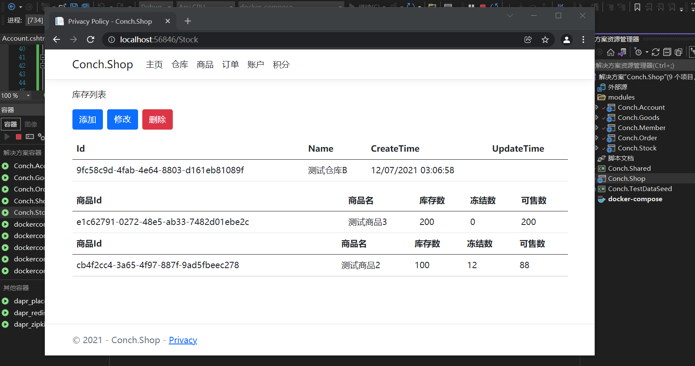

### Conch.Shop
基于Dapr的分布式商城测试演示程序
Distributed mall test demonstration program based on dapr

### Technology
- Net 6.0
- Dapr 1.5.1
- Grpc
- Docker

### Demo


### Install

clone the Conch.Shop:

````bash
git clone https://github.com/git102347501/Conch.Shop.git
````

### Environmental preparation
- [Install Dapr](https://docs.dapr.io/getting-started/install-dapr-cli/)
- [Install Docker](https://docs.docker.com/get-docker/)
- [Install NET 6.0](https://dotnet.microsoft.com/en-us/download/dotnet/6.0)
- [Init Dapr](https://docs.dapr.io/getting-started/install-dapr-selfhost/)
